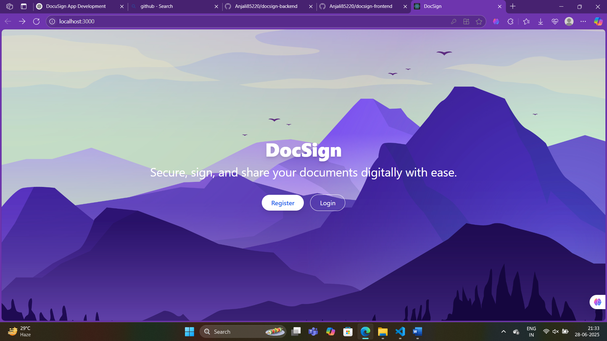
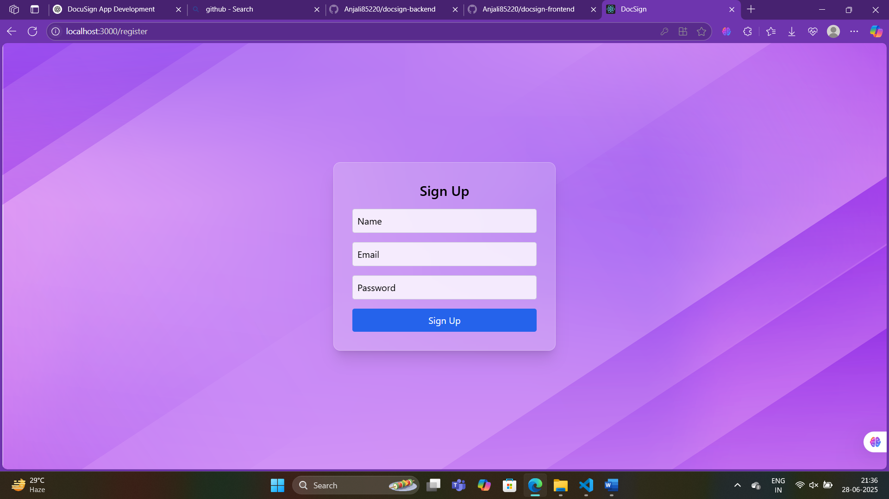
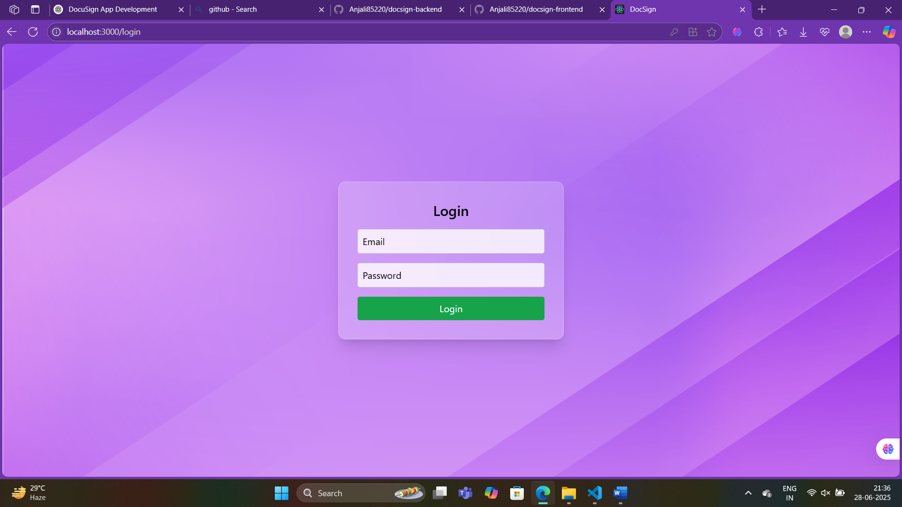
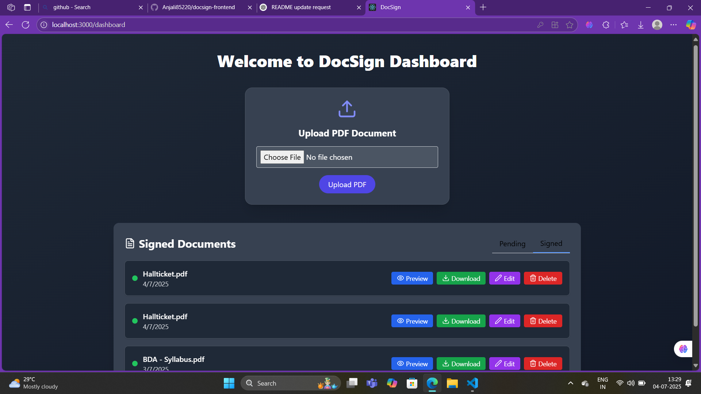
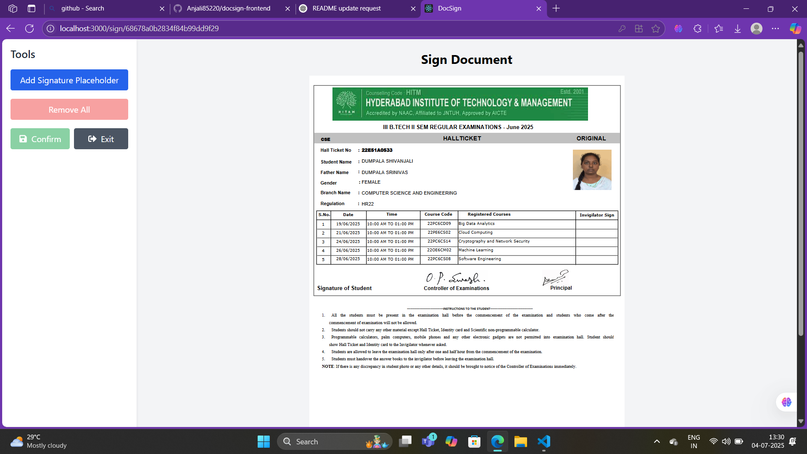

# 📄 DocSign Frontend

Welcome to the **DocSign** frontend – a secure document signing application. Built using **React** and **Tailwind CSS**, this UI allows users to register, login, upload PDFs, and eventually drag and drop signatures onto documents.

## 🚀 Tech Stack

- React.js (Vite)
- Tailwind CSS
- Axios
- React Router DOM
- React-PDF
- pdf-lib
- react-signature-canvas
- FileSaver.js

## ✅ Completed Features

### 🌄 UI & Auth
- [x] React app scaffolded with Tailwind CSS
- [x] Beautiful homepage with mountain-themed night design
- [x] Glassmorphism-style Register and Login pages
- [x] Auth forms (register, login)
- [x] API integration with backend for authentication

### 📂 Dashboard
- [x] Upload PDF documents
- [x] View list of uploaded files
- [x] Preview PDFs within the app
- [x] Navigate between multiple pages of a PDF

### ✍️ Sign Page
- [x] Display PDF with page navigation
- [x] Add draggable signature placeholders
- [x] Signature options: type (font), draw, or upload image
- [x] Resize, drag, and lock signature placeholders
- [x] Confirm placement before downloading
- [x] Download signed PDF with embedded signature
- [x] Signature positioning fixed to match PDF layout
- [x] Support for public sign links (via email)

## 🖼️ Screenshots

### 🏠 Home Page



### 📝 Register Page



### 🔐 Login Page



### 📁 Dashboard Page



### ✍️ Sign Page



## 🧪 Environment Variables

Create a `.env` file in the `frontend/` directory:

```env
Deployed URLs
Frontend: https://docsign-frontend.vercel.app

Backend: https://docsign-backend.onrender.com